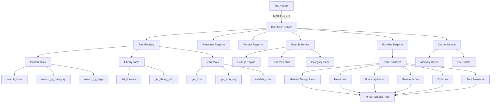
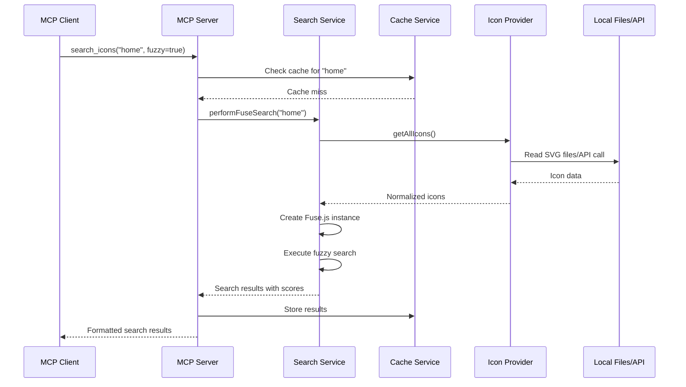
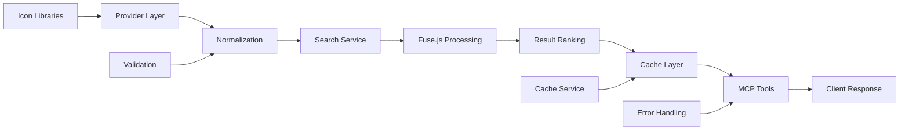
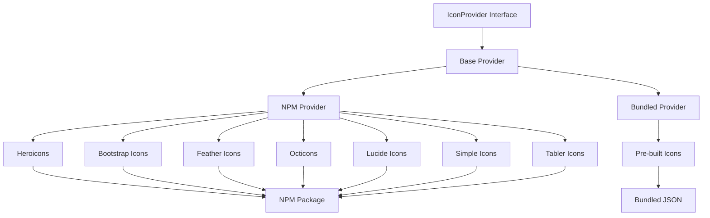
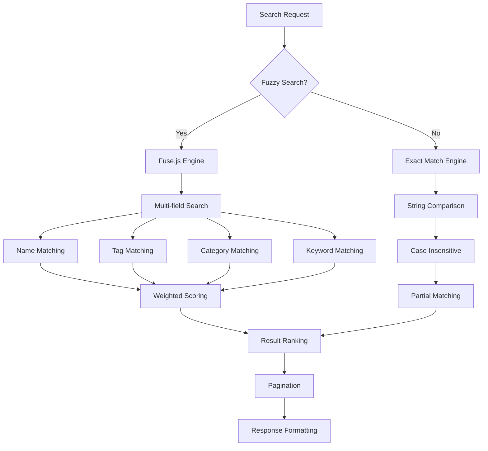
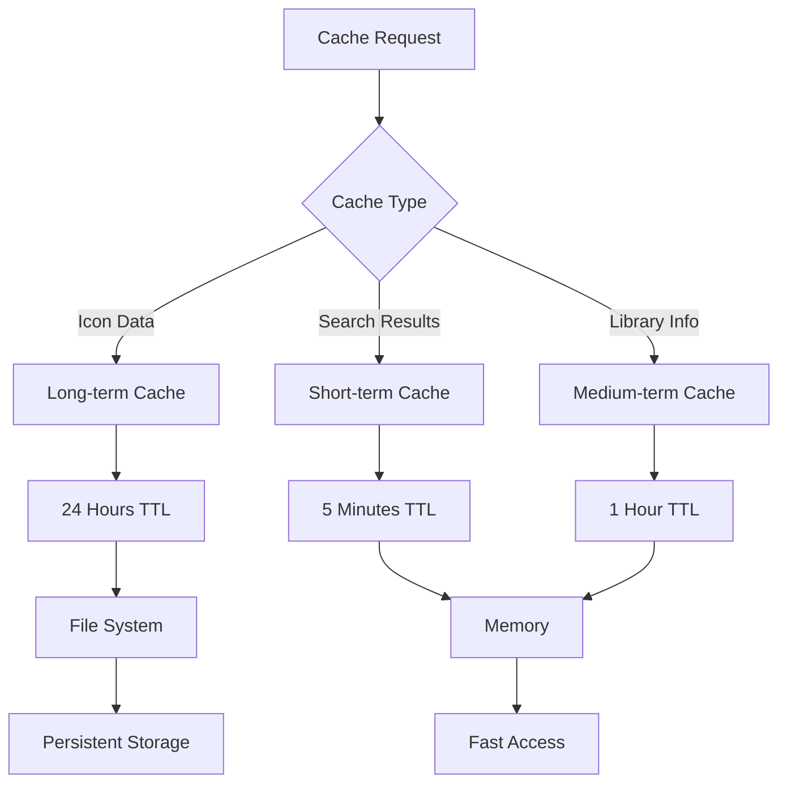
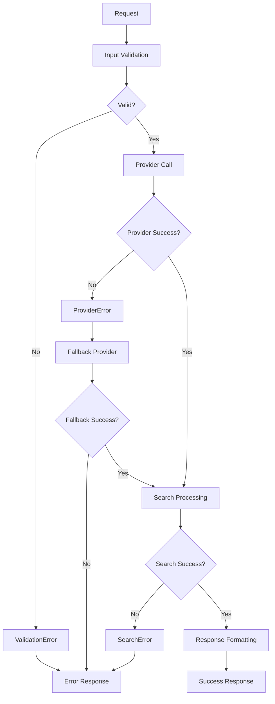

# Icon MCP Server Architecture

## High-Level Overview

## Component Flow Diagram

## Data Flow Architecture

## Provider Architecture

## Search Engine Architecture

## Cache Strategy

## Error Handling Flow

## Key Components

### 1. MCP Server Core

- **Tool Registry**: Manages all available MCP tools
- **Resource Registry**: Handles static and dynamic resources
- **Prompt Registry**: Provides guided interaction prompts

### 2. Search Engine

- **Fuse.js Integration**: Fuzzy search with typo tolerance
- **Multi-field Search**: Name, tags, categories, keywords
- **Weighted Scoring**: Relevance-based result ranking
- **Exact Search Fallback**: For precise matching needs

### 3. Provider System

- **Unified Interface**: Consistent API across all providers
- **Multiple Sources**: Local files, APIs, NPM packages
- **Data Normalization**: Standardized icon format
- **Error Handling**: Graceful degradation and fallbacks

### 4. Caching Layer

- **Multi-level Caching**: Memory and file-based storage
- **TTL Management**: Different expiration times by data type
- **Cache Invalidation**: Smart cache refresh strategies

### 5. Icon Libraries Supported

- Heroicons (NPM Package)
- Bootstrap Icons (NPM Package)
- Feather Icons (NPM Package)
- Octicons (NPM Package)
- Lucide Icons (NPM Package)
- Simple Icons (NPM Package)
- Tabler Icons (NPM Package)

## Request/Response Flow

1. **Client Request**: MCP client sends tool request
2. **Input Validation**: Server validates parameters using Zod schemas
3. **Cache Check**: Search service checks for cached results
4. **Provider Query**: If cache miss, query appropriate providers
5. **Data Processing**: Normalize and prepare icon data
6. **Search Execution**: Run fuzzy or exact search algorithm
7. **Result Ranking**: Score and sort results by relevance
8. **Cache Storage**: Store results for future requests
9. **Response Formatting**: Format results according to MCP specification
10. **Client Response**: Return structured data to client

## Performance Characteristics

- **Search Latency**: < 100ms for cached results, < 500ms for fresh searches
- **Memory Usage**: Efficient Fuse.js instances with lazy loading
- **Scalability**: Horizontal scaling through stateless design
- **Reliability**: Multiple fallback mechanisms and error recovery
