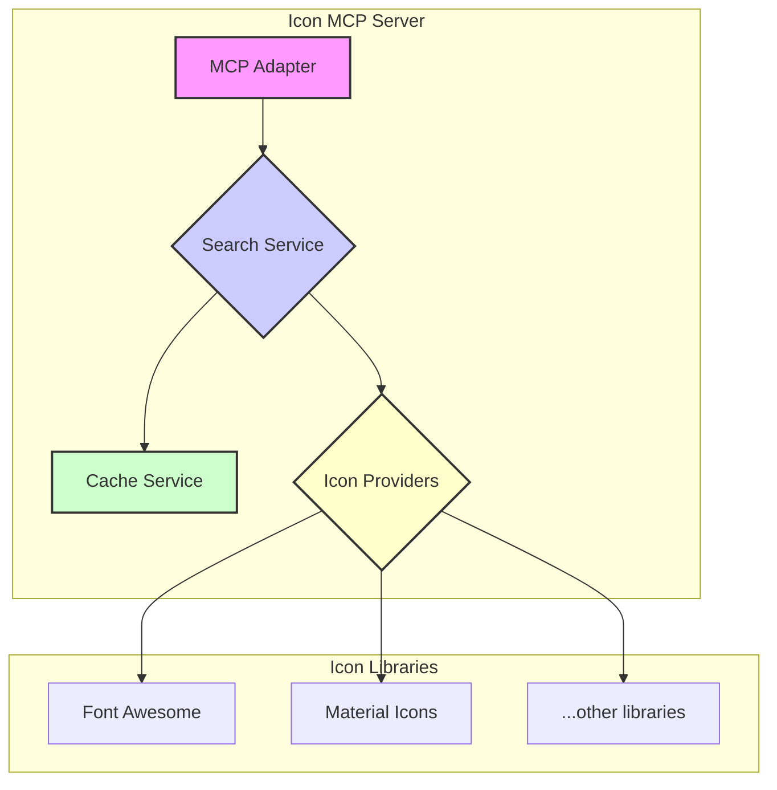

# Project: Icon MCP Server

## 1. Overview

This project implements a Model Context Protocol (MCP) server for searching a unified collection of icons from multiple sources. It provides a single interface to query different icon libraries, making it easy to find and use icons from various design systems.

## 2. Core Principles

- **Unified Search**: Provide a single search interface for multiple icon libraries
- **Fuzzy Search**: Intelligent search with typo tolerance and partial matching using Fuse.js
- **Advanced Search**: Support for weighted search keys, threshold tuning, and location-aware matching
- **Extensible**: Easily add new icon libraries and sources
- **Performance**: Fast and responsive search results with relevance scoring and caching
- **Type-safe**: Use TypeScript for all data structures and APIs
- **Standardized Output**: Return consistent icon data format across all sources

## 3. Architecture

The server will be composed of the following core components:

- **Icon Providers**: Connectors to different icon libraries (e.g., Font Awesome, Material Icons)
- **Search Service**: A centralized service with Fuse.js fuzzy search capabilities to query all icon providers
- **Cache Service**: A caching layer to improve performance
- **MCP Adapter**: The main entry point for handling MCP requests



## 4. Implementation Plan

### Phase 1: Core Infrastructure

- **Project Setup**: Initialize a new TypeScript project
- **MCP Server**: Create the basic MCP server structure
- **Cache Service**: Implement a simple in-memory cache

### Phase 2: Icon Providers

- **Git Submodule Approach**: Implement icon providers using Git submodules (inspired by svelte-icons)
- **Material Design Icons**: Google's Material Design icon collection
- **Octicons**: GitHub's icon library
- **Feather Icons**: Simply beautiful open source icons
- **Heroicons**: Beautiful hand-crafted SVG icons by Tailwind Labs
- **Bootstrap Icons**: Official open source SVG icon library for Bootstrap
- **Lucide**: Beautiful & consistent icon toolkit
- **Boxicons**: Simple vector icons carefully crafted for designers & developers
- **Remix Icon**: Open source neutral style icon system
- **Simple Icons**: SVG icons for popular brands
- **Tabler Icons**: Over 4000+ free SVG icons
- **Zondicons**: A set of free premium SVG icons
- **Eva Icons**: A pack of more than 480 beautifully crafted Open Source icons
- **Teenyicons**: Tiny minimal 1px icons

### Phase 3: Search and Discovery

- **Search Service**: Implement the core search logic with Fuse.js fuzzy search capabilities
- **Fuse.js Integration**: Add intelligent matching with typo tolerance, relevance scoring, and advanced options
- **Multi-field Search**: Search across icon names, tags, categories, and keywords with weighted keys
- **Search Customization**: Support for threshold adjustment, case sensitivity, and location-aware matching
- **Local SVG Processing**: Read and process SVG files from Git submodules (like svelte-icons)
- **Icon Index Generation**: Build searchable index from local SVG files
- **MCP Tools**: Create tools for searching icons and getting icon details

### Phase 4: Git Submodule Integration

- **Submodule Setup**: Configure Git submodules for icon libraries
- **SVG Processing Scripts**: Create scripts to process SVG files from submodules
- **Icon Metadata Extraction**: Extract tags, categories, and metadata from SVG files
- **Index Building**: Generate searchable index from processed SVG data

### Phase 5: Deployment and Distribution

- **Dockerize**: Create a Dockerfile for easy deployment
- **NPM Package**: Publish the server as an NPM package
- **Submodule Management**: Include submodule update scripts for CI/CD

## 5. Git Submodule Strategy (Inspired by svelte-icons)

### Project Structure

```
icon-mcp/
├── icon-libraries/             # Git submodules directory
│   ├── material-design-icons/ # Git submodule
│   │   ├── src/
│   ├── octicons/              # Git submodule
│   │   ├── icons/
│   ├── feather/               # Git submodule
│   │   ├── icons/
│   ├── heroicons/             # Git submodule
│   │   ├── optimized/
│   │   │   ├── 24/solid/
│   │   │   └── 24/outline/
│   ├── icons/                 # Bootstrap Icons Git submodule
│   │   ├── icons/
│   ├── lucide/                # Git submodule
│   │   ├── icons/
│   ├── boxicons/              # Git submodule
│   │   ├── svg/
│   ├── remixicon/             # Git submodule
│   │   ├── icons/
│   ├── simple-icons/          # Git submodule
│   │   ├── icons/
│   ├── tabler-icons/          # Git submodule
│   │   ├── icons/
│   ├── zondicons/             # Git submodule
│   │   ├── src/
│   ├── eva-icons/             # Git submodule
│   │   ├── fill/svg/
│   │   └── outline/svg/
│   └── teenyicons/            # Git submodule
│       ├── outline/
│       └── solid/
├── icons.json                 # Generated index of all icons
├── scripts/
│   ├── build-index.js         # Builds icons.json from SVG files
│   ├── update-submodules.js   # Updates Git submodules
│   └── scan-icons.js          # Scans and processes SVG files
├── src/
│   ├── index.ts               # MCP server entry point
│   ├── services/
│   └── providers/
└── package.json
```

### Icons Index File (icons.json)

The `icons.json` file contains a comprehensive array of all processed icons from Git submodules:

```json
[
  {
    "name": "arrow-right",
    "library": "octicons",
    "tags": ["arrow", "right", "direction"],
    "style": "regular",
    "path": "icon-libraries/octicons/icons/arrow-right-24.svg",
    "categories": ["navigation"],
    "size": "24x24",
    "source": "https://github.com/primer/octicons",
    "updatedAt": "2025-07-30T12:00:00Z"
  },
  {
    "name": "home",
    "library": "heroicons",
    "tags": ["house", "building", "main"],
    "style": "solid",
    "path": "icon-libraries/heroicons/optimized/24/solid/home.svg",
    "categories": ["navigation", "buildings"],
    "size": "24x24",
    "source": "https://github.com/tailwindlabs/heroicons",
    "updatedAt": "2025-07-30T12:00:00Z"
  }
]
```

### Build Scripts

#### build-index.js

Main script that generates the `icons.json` file:

```bash
# Build the complete icon index
node scripts/build-index.js

# Build index for specific libraries only
node scripts/build-index.js --libraries=heroicons,octicons

# Rebuild index with verbose output
node scripts/build-index.js --verbose
```

#### Script Workflow

1. **Initialize Submodules**: Ensure all Git submodules are initialized and updated
2. **Scan Libraries**: Recursively scan each icon library for SVG files
3. **Extract Metadata**: Parse SVG files to extract viewBox, paths, and metadata
4. **Generate Tags**: Derive tags from file paths, names, and SVG content analysis
5. **Build Schema**: Create icon objects matching the defined schema
6. **Write Index**: Save the complete array to `icons.json`
7. **Validate**: Ensure all generated entries match the schema

### SVG Processing Pipeline

1. **File Discovery**: Find all `.svg` files in submodule directories
2. **Path Analysis**: Extract library, style, and category from file paths
3. **SVG Parsing**: Parse SVG content for viewBox, dimensions, and complexity
4. **Tag Generation**: Generate searchable tags from filename and content
5. **Schema Mapping**: Map extracted data to the icon schema format
6. **Deduplication**: Remove duplicate icons across libraries

### Submodule Management Commands

```bash
# Initialize all icon library submodules
git submodule update --init --recursive

# Update all submodules to latest versions
git submodule update --remote --merge

# Add new icon library as submodule (examples)
git submodule add https://github.com/google/material-design-icons.git icon-libraries/material-design-icons
git submodule add https://github.com/primer/octicons.git icon-libraries/octicons
git submodule add https://github.com/feathericons/feather.git icon-libraries/feather
git submodule add https://github.com/tailwindlabs/heroicons.git icon-libraries/heroicons
git submodule add https://github.com/twbs/icons.git icon-libraries/icons
git submodule add https://github.com/lucide-icons/lucide.git icon-libraries/lucide
git submodule add https://github.com/atisawd/boxicons.git icon-libraries/boxicons
git submodule add https://github.com/Remix-Design/RemixIcon.git icon-libraries/remixicon
git submodule add https://github.com/simple-icons/simple-icons.git icon-libraries/simple-icons
git submodule add https://github.com/tabler/tabler-icons.git icon-libraries/tabler-icons
git submodule add https://github.com/dukestreetstudio/zondicons.git icon-libraries/zondicons
git submodule add https://github.com/akveo/eva-icons.git icon-libraries/eva-icons
git submodule add https://github.com/teenyicons/teenyicons.git icon-libraries/teenyicons

# Build icon index after submodule updates
node scripts/build-index.js

# Complete workflow: update submodules and rebuild index
npm run update-icons
```

### Package.json Scripts

```json
{
  "scripts": {
    "build-index": "node scripts/build-index.js",
    "update-submodules": "node scripts/update-submodules.js",
    "update-icons": "npm run update-submodules && npm run build-index",
    "scan-icons": "node scripts/scan-icons.js"
  }
}
```

## 6. Data Models

### Icon

```typescript
interface Icon {
  name: string; // Icon name (e.g., "arrow-right")
  library: string; // Library name (e.g., "octicons")
  tags: string[]; // Searchable tags (e.g., ["arrow", "right"])
  style?: string; // Style variant (e.g., "solid", "outline", "regular")
  path: string; // Local file path to SVG (e.g., "icon-libraries/octicons/build/svg/arrow-right.svg")
  categories?: string[]; // Categories (e.g., ["navigation"])
  size?: string; // Icon size (e.g., "24x24", "16x16")
  source?: string; // Source repository URL (e.g., "https://github.com/primer/octicons")
  updatedAt?: string; // Last update timestamp (e.g., "2025-07-30T12:00:00Z")
}
```

### Icon Schema Validation

```typescript
import { z } from 'zod';

const IconSchema = z.object({
  name: z.string().min(1),
  library: z.string().min(1),
  tags: z.array(z.string()),
  style: z.string().optional(),
  path: z.string().min(1),
  categories: z.array(z.string()).optional(),
  size: z.string().optional(),
  source: z.string().url().optional(),
  updatedAt: z.string().datetime().optional(),
});

type Icon = z.infer<typeof IconSchema>;
```

### SearchResult

```typescript
interface SearchResult {
  query: string;
  results: FuseResult<Icon>[];
  totalResults: number;
  searchType: 'fuzzy' | 'exact' | 'filtered' | 'failed';
  executionTime: number;
  libraries: string[];
  fuseOptions?: Partial<Fuse.IFuseOptions<Icon>>;
  error?: string;
}

interface FuseResult<T> {
  item: T;
  score?: number; // Relevance score (0 = perfect match, 1 = no match)
  matches?: FuseMatch[]; // Match details for highlighting
  refIndex?: number; // Original index in the dataset
}

interface FuseMatch {
  indices: number[][]; // Character indices of matches
  value: string; // Matched text value
  key: string; // Field name that matched
  arrayIndex?: number; // Index if field is an array
}

interface AutocompleteResult {
  suggestions: string[];
  categories: string[];
  libraries: string[];
  executionTime: number;
}

interface SimilarIconsResult {
  originalIcon: Icon;
  similarIcons: FuseResult<Icon>[];
  totalSimilar: number;
  searchCriteria: {
    threshold: number;
    sameLibraryOnly: boolean;
    fieldsCompared: string[];
  };
}
```

### IconLibrary

```typescript
interface IconLibrary {
  name: string;
  displayName: string;
  description: string;
  version: string;
  iconCount: number;
  submodulePath: string; // Path to Git submodule
  sourceUrl: string; // Original repository URL
  license: string;
  styles: string[]; // Available styles (solid, outline, etc.)
  categories: string[]; // Available categories
  lastUpdated: string; // Last submodule update
}
```

### SVGMetadata

```typescript
interface SVGMetadata {
  viewBox: string;
  width?: number;
  height?: number;
  paths: string[]; // SVG path elements
  fills: string[]; // Fill colors used
  strokes: string[]; // Stroke colors used
  hasAnimations: boolean; // Contains animations
  complexity: number; // Relative complexity score
}
```

## 7. Fuse.js Integration Details

### Fuse.js Configuration Options

Based on the official Fuse.js documentation, the following configuration options are available for advanced search customization:

#### Basic Options

```typescript
interface FuseOptions<T> {
  // Case sensitivity
  isCaseSensitive?: boolean; // Default: false

  // Diacritics handling
  ignoreDiacritics?: boolean; // Default: false

  // Result formatting
  includeScore?: boolean; // Default: false - Include relevance score (0 = perfect, 1 = no match)
  includeMatches?: boolean; // Default: false - Include match indices for highlighting

  // Match filtering
  minMatchCharLength?: number; // Default: 1 - Minimum character length for matches

  // Result sorting
  shouldSort?: boolean; // Default: true - Sort results by score
  findAllMatches?: boolean; // Default: false - Continue searching after perfect match

  // Search keys
  keys?: Array<string | FuseOptionKey<T>>; // Fields to search in
}
```

#### Fuzzy Matching Options

```typescript
interface FuzzyMatchingOptions {
  // Location-based matching
  location?: number; // Default: 0 - Expected pattern location
  threshold?: number; // Default: 0.6 - Match threshold (0.0 = perfect, 1.0 = anything)
  distance?: number; // Default: 100 - How far from location to search
  ignoreLocation?: boolean; // Default: false - Ignore location and distance

  // Field normalization
  ignoreFieldNorm?: boolean; // Default: false - Ignore field-length norm in scoring
  fieldNormWeight?: number; // Default: 1 - Field-length norm weight (0 = ignore, 2 = increase effect)
}
```

#### Advanced Options

```typescript
interface AdvancedOptions<T> {
  // Extended search syntax
  useExtendedSearch?: boolean; // Default: false - Enable unix-like search commands

  // Custom functions
  getFn?: (obj: T, path: string | string[]) => string | string[]; // Custom value retrieval
  sortFn?: (a: FuseResult<T>, b: FuseResult<T>) => number; // Custom sorting function
}
```

### Weighted Search Keys Configuration

```typescript
// Multi-field search with weighted importance
const fuseOptions: Fuse.IFuseOptions<Icon> = {
  keys: [
    // Primary search fields (highest weight)
    { name: 'name', weight: 1.0 }, // Icon name gets full weight
    { name: 'id', weight: 0.8 }, // Icon ID gets high weight

    // Secondary search fields (medium weight)
    { name: 'tags', weight: 0.6 }, // Tags get medium weight
    { name: 'keywords', weight: 0.5 }, // Keywords get medium-low weight

    // Tertiary search fields (low weight)
    { name: 'categories', weight: 0.4 }, // Categories get lower weight
    { name: 'library', weight: 0.3 }, // Library name gets lowest weight
  ],

  // Optimal settings for icon search
  threshold: 0.3, // Allow some fuzziness but maintain relevance
  location: 0, // Start searching from beginning
  distance: 100, // Allow reasonable distance from start
  minMatchCharLength: 2, // Require at least 2 characters to match
  includeScore: true, // Include scores for ranking
  includeMatches: true, // Include match details for highlighting
  shouldSort: true, // Sort by relevance
  ignoreLocation: false, // Consider location in scoring
  ignoreFieldNorm: false, // Consider field length in scoring
};
```

### Search Performance Optimization

```typescript
// Performance-optimized Fuse.js configuration
const performanceOptimizedOptions: Fuse.IFuseOptions<Icon> = {
  // Limit search scope for better performance
  threshold: 0.4, // Slightly higher threshold for faster search
  minMatchCharLength: 3, // Require more characters to reduce false positives
  findAllMatches: false, // Stop at first good match per field

  // Optimize field normalization
  ignoreFieldNorm: true, // Skip field normalization for speed
  fieldNormWeight: 0, // Disable field norm weight calculation

  // Limit location-based calculations
  ignoreLocation: true, // Skip location-based scoring for speed

  // Essential options only
  includeScore: true,
  shouldSort: true,
  keys: ['name', 'tags'], // Search only essential fields
};
```

### Extended Search Syntax

When `useExtendedSearch` is enabled, Fuse.js supports advanced query syntax:

```typescript
// Enable extended search for advanced queries
const extendedSearchOptions: Fuse.IFuseOptions<Icon> = {
  useExtendedSearch: true,
  threshold: 0.3,
  keys: ['name', 'tags', 'categories'],
};

// Example extended search queries:
// 'arrow          - Fuzzy search for "arrow"
// =arrow          - Exact match for "arrow"
// 'arrow !right   - Include "arrow" but exclude "right"
// ^arrow          - Items that start with "arrow"
// arrow$          - Items that end with "arrow"
// !arrow          - Items that do not include "arrow"
```

### Error Handling and Fallback Strategies

```typescript
class FuseSearchService {
  private fuseInstances: Map<string, Fuse<Icon>> = new Map();

  async searchWithFallback(
    query: string,
    options: Partial<Fuse.IFuseOptions<Icon>> = {}
  ): Promise<SearchResult> {
    try {
      // Primary search with fuzzy matching
      return await this.performFuseSearch(query, {
        threshold: 0.3,
        includeScore: true,
        includeMatches: true,
        ...options,
      });
    } catch (error) {
      console.warn(`Fuse.js search failed for "${query}":`, error);

      try {
        // Fallback to exact search
        return await this.performExactSearch(query, options);
      } catch (fallbackError) {
        console.error(`All search methods failed for "${query}":`, fallbackError);

        // Return empty result with error indication
        return {
          query,
          results: [],
          totalResults: 0,
          searchType: 'failed',
          executionTime: 0,
          error: 'Search service temporarily unavailable',
        };
      }
    }
  }

  private validateSearchQuery(query: string): void {
    if (!query || query.trim().length === 0) {
      throw new Error('Search query cannot be empty');
    }

    if (query.length > 100) {
      throw new Error('Search query too long (max 100 characters)');
    }

    // Sanitize query to prevent injection attacks
    const sanitizedQuery = query.replace(/[<>\"']/g, '');
    if (sanitizedQuery !== query) {
      console.warn('Search query contained potentially unsafe characters');
    }
  }
}
```

### Caching Strategy for Fuse.js Instances

```typescript
interface FuseCacheConfig {
  maxInstances: number; // Maximum cached Fuse instances
  ttl: number; // Time to live in milliseconds
  preloadLibraries: string[]; // Libraries to preload on startup
}

class FuseInstanceManager {
  private cache = new Map<string, { fuse: Fuse<Icon>; lastUsed: number }>();
  private config: FuseCacheConfig;

  constructor(config: FuseCacheConfig) {
    this.config = config;
    this.startCleanupTimer();
  }

  getFuseInstance(libraryName: string, icons: Icon[]): Fuse<Icon> {
    const cacheKey = `${libraryName}-${icons.length}`;
    const cached = this.cache.get(cacheKey);

    if (cached) {
      cached.lastUsed = Date.now();
      return cached.fuse;
    }

    // Create new Fuse instance
    const fuse = new Fuse(icons, this.getOptimalOptions(icons.length));

    // Cache with LRU eviction
    this.addToCache(cacheKey, fuse);

    return fuse;
  }

  private getOptimalOptions(iconCount: number): Fuse.IFuseOptions<Icon> {
    // Adjust options based on dataset size
    if (iconCount > 10000) {
      // Large dataset - optimize for performance
      return {
        threshold: 0.4,
        ignoreLocation: true,
        ignoreFieldNorm: true,
        keys: ['name', 'tags'],
        includeScore: true,
      };
    } else if (iconCount > 1000) {
      // Medium dataset - balanced approach
      return {
        threshold: 0.3,
        location: 0,
        distance: 100,
        keys: ['name', 'tags', 'categories'],
        includeScore: true,
        includeMatches: true,
      };
    } else {
      // Small dataset - full feature set
      return {
        threshold: 0.2,
        location: 0,
        distance: 100,
        keys: ['name', 'tags', 'categories', 'keywords'],
        includeScore: true,
        includeMatches: true,
        useExtendedSearch: true,
      };
    }
  }

  private addToCache(key: string, fuse: Fuse<Icon>): void {
    // Implement LRU eviction if cache is full
    if (this.cache.size >= this.config.maxInstances) {
      const oldestKey = this.findOldestCacheEntry();
      this.cache.delete(oldestKey);
    }

    this.cache.set(key, {
      fuse,
      lastUsed: Date.now(),
    });
  }

  private findOldestCacheEntry(): string {
    let oldestKey = '';
    let oldestTime = Date.now();

    for (const [key, value] of this.cache.entries()) {
      if (value.lastUsed < oldestTime) {
        oldestTime = value.lastUsed;
        oldestKey = key;
      }
    }

    return oldestKey;
  }

  private startCleanupTimer(): void {
    setInterval(() => {
      const now = Date.now();
      for (const [key, value] of this.cache.entries()) {
        if (now - value.lastUsed > this.config.ttl) {
          this.cache.delete(key);
        }
      }
    }, this.config.ttl / 2); // Clean up every half TTL period
  }
}
```

## 8. Tools

### Enhanced Search Tools with Fuse.js Integration

- `search_icons(query: string, options?: FuseSearchOptions)`: Advanced icon search with comprehensive Fuse.js options

  ```typescript
  interface FuseSearchOptions {
    libraries?: string[]; // Specific libraries to search in
    fuzzy?: boolean; // Enable/disable fuzzy search (default: true)
    threshold?: number; // Search threshold 0.0-1.0 (default: 0.3)
    limit?: number; // Maximum results (default: 50)
    includeScore?: boolean; // Include relevance scores (default: true)
    includeMatches?: boolean; // Include match details for highlighting (default: true)
    keys?: string[]; // Specific fields to search in
    useExtendedSearch?: boolean; // Enable advanced query syntax (default: false)
    ignoreLocation?: boolean; // Ignore location-based scoring (default: false)
    minMatchCharLength?: number; // Minimum match length (default: 2)
    isCaseSensitive?: boolean; // Case sensitive search (default: false)
  }
  ```

- `get_icon(name: string, library: string)`: Get a specific icon by name and library, return SVG content from local file

- `list_libraries()`: List all available icon libraries from `icons.json`

- `search_similar(iconName: string, library: string, options?: SimilarSearchOptions)`: Find icons similar to a given icon using Fuse.js similarity scoring

  ```typescript
  interface SimilarSearchOptions {
    limit?: number; // Maximum similar icons to return (default: 10)
    threshold?: number; // Similarity threshold (default: 0.4)
    excludeOriginal?: boolean; // Exclude the original icon from results (default: true)
    sameLibraryOnly?: boolean; // Search only within the same library (default: false)
  }
  ```

- `search_by_style(style: string, libraries?: string[], searchOptions?: FuseSearchOptions)`: Search icons by style with optional fuzzy matching on style names

- `search_by_category(category: string, libraries?: string[], searchOptions?: FuseSearchOptions)`: Search icons by category with optional fuzzy matching on category names

- `get_library_info(library: string)`: Get detailed information about a specific icon library

- `search_with_filters(query: string, filters: SearchFilters)`: Advanced search with multiple filter criteria

  ```typescript
  interface SearchFilters {
    libraries?: string[]; // Filter by specific libraries
    styles?: string[]; // Filter by icon styles
    categories?: string[]; // Filter by categories
    sizes?: string[]; // Filter by icon sizes
    tags?: string[]; // Must include these tags
    excludeTags?: string[]; // Must not include these tags
    fuseOptions?: FuseSearchOptions; // Fuse.js search configuration
  }
  ```

- `search_autocomplete(partialQuery: string, options?: AutocompleteOptions)`: Get search suggestions for partial queries
  ```typescript
  interface AutocompleteOptions {
    maxSuggestions?: number; // Maximum suggestions (default: 10)
    includeLibraries?: boolean; // Include library names in suggestions (default: true)
    includeCategories?: boolean; // Include category names in suggestions (default: true)
    minQueryLength?: number; // Minimum query length for suggestions (default: 2)
  }
  ```

## 9. Implementation Details

### Build Index Script Structure

```typescript
// scripts/build-index.js
interface IndexBuilder {
  scanAllSubmodules(): Promise<Icon[]>;
  processLibrary(libraryPath: string, libraryName: string): Promise<Icon[]>;
  parseSVGFile(filePath: string): Promise<Partial<Icon>>;
  extractTagsFromPath(filePath: string): string[];
  extractTagsFromSVG(svgContent: string): string[];
  generateIconEntry(filePath: string, libraryName: string): Promise<Icon>;
  saveIconsIndex(icons: Icon[]): Promise<void>;
  validateIconSchema(icon: unknown): Icon;
}
```

### SVG File Processing

```typescript
interface SVGProcessor {
  scanDirectory(path: string): Promise<string[]>;
  parseSVG(filePath: string): Promise<SVGMetadata>;
  extractTags(filePath: string, svgContent: string): string[];
  extractCategories(filePath: string): string[];
  detectStyle(filePath: string): string | undefined;
  getIconSize(svgContent: string): string | undefined;
  buildIconEntry(filePath: string, library: string): Promise<Icon>;
}
```

### Icon Index Management

```typescript
interface IconIndex {
  loadIndex(): Promise<Icon[]>;
  saveIndex(icons: Icon[]): Promise<void>;
  updateIndex(library?: string): Promise<void>;
  validateIndex(): Promise<boolean>;
  getIndexStats(): Promise<IndexStats>;
}

interface IndexStats {
  totalIcons: number;
  librariesCount: number;
  lastUpdated: string;
  libraryBreakdown: Record<string, number>;
}
```

### Submodule Manager

```typescript
interface SubmoduleManager {
  initializeSubmodules(): Promise<void>;
  updateSubmodules(libraries?: string[]): Promise<void>;
  addSubmodule(url: string, path: string): Promise<void>;
  removeSubmodule(path: string): Promise<void>;
  getSubmoduleStatus(): Promise<SubmoduleStatus[]>;
}
```

## 10. Milestones

- **M1**: Create `build-index.js` script and generate initial `icons.json`
- **M2**: Set up Git submodule infrastructure with Material Design Icons and Octicons
- **M3**: Implement MCP server with Fuse.js search using `icons.json`
- **M4**: Add Feather, Heroicons, and Bootstrap Icons via Git submodules
- **M5**: Add Lucide, Boxicons, and Remix Icon support
- **M6**: Add Simple Icons, Tabler Icons, and Zondicons support
- **M7**: Add Eva Icons and Teenyicons support
- **M8**: Implement advanced search features (style, category filtering)
- **M9**: Performance optimization and caching improvements
- **M10**: Publish as NPM package with complete submodule management
